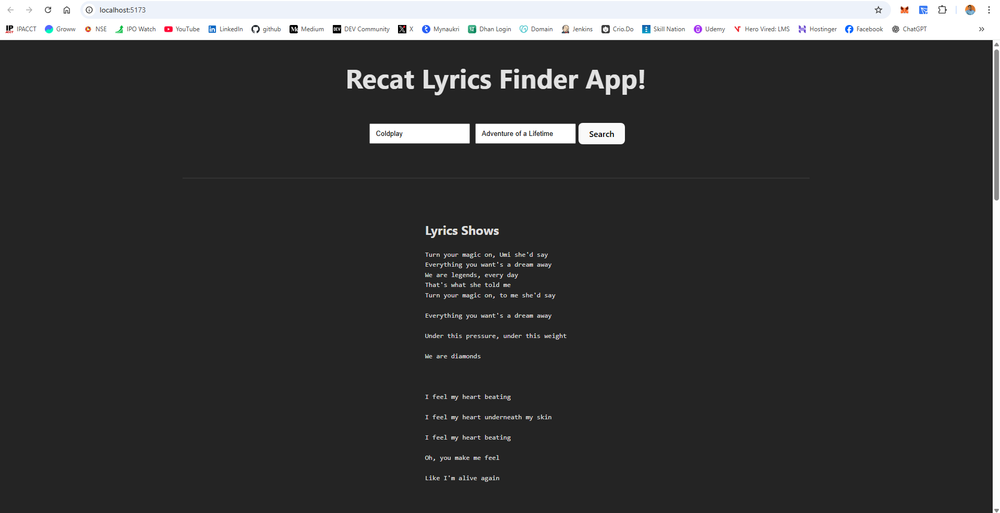

# 🎵 Lyrics Finder & Music Player App

A simple and elegant React-based web application that allows users to **search for lyrics** of their favorite songs by providing the **song title** and **artist name**, and also **listen to the song** via embedded YouTube playback.

---

## 🌐 Live Demo

👉 [View Live App on Vercel](https://react-lyrics-finder.vercel.app)

---

## 🚀 Features

- 🔍 **Lyrics Search**  
  Type a song name and artist to instantly fetch lyrics using the [lyrics.ovh](https://lyricsovh.docs.apiary.io/) API.

- ▶️ **Song Playback**  
  Embedded YouTube search lets users listen to the song they searched for.

- 🎧 **Responsive UI**  
  Clean and minimal design that works on desktop and mobile.

- ⚙️ **Proxy Backend**  
  Bypasses CORS issues using a simple Node.js Express proxy server.

---

## 📸 Screenshots



---

## 🛠️ Tech Stack

**Frontend:**
- React
- Axios
- CSS

**Backend:**
- Node.js
- Express
- Axios
- CORS

---

## ⚙️ How to Run Locally

### 1. Clone the Repo

```bash
git clone https://github.com/surendergupta/react-lyrics-finder.git
cd react-lyrics-finder
```

### 2. Install Dependencies

```bash
npm install
npm run dev
```
Your Frotend should run on: `http://localhost:5173/`

### 3. Start Backend Server (Proxy)

```bash
cd backend
npm install
node index.js

```
Your proxy server should run on: `http://localhost:5000`

---

## 🌐 Usage
1. Enter the **song name** and **artist name** in the input fields.
2. Click **Search**.
3. Lyrics will be displayed, and an embedded YouTube player will load the song.

---

## 📦 Folder Structure

```bash
react-lyrics-finder/
├── src/                 # React frontend 
│   ├── components/
│   │   ├── AudioPlayer/
│   │   ├── LyricsDisplay/
│   │   ├── SearchBar/
│   │   ├── SearchBar.jsx
│   │   ├── LyricsDisplay.jsx
│   │   └── AudioPlayer.jsx
│   ├── App.css
│   ├── App.jsx
│   ├── index.css
│   └── main.jsx
├── backend/                 # Express backend
│   └── index.js
├── README.md

```

---

## 📌 Limitations
- `lyrics.ovh` API is unstable and may time out or return incomplete data.
- Fallback lyrics or switching to Musixmatch API is recommended for production use.

---

## 💡 Future Improvements
- Add loading indicator while fetching
- Display error messages in UI
- Dark mode toggle
- Use Musixmatch or Genius API for more reliable results

---

## 🧑‍💻 Author
Surender Gupta
Feel free to connect or contribute!

---

## 📄 License
This project is open-source and available under the MIT License.